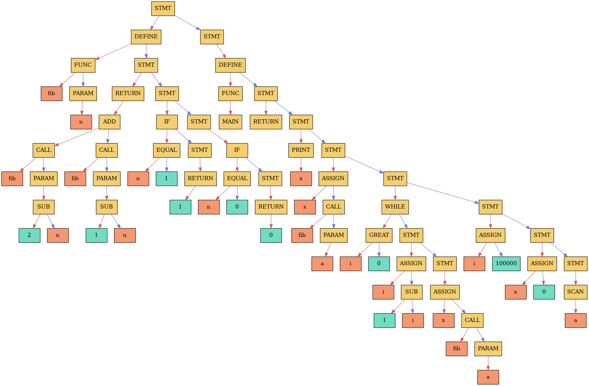

# x86-64 компилятор

## Введение

Доброго дня всем читающим!

Этот проект представляет собой компилятор для [моего языка программирования](https://github.com/phrolow/Language). Компилятор считывает исходник, написанный на моём C-подобном языке (далее - "язык") и переводит его в дерево, по которому уже создаётся двоичный код из x86-64 команд. Результат работы компилятора - полноценный ELF-файл.

## О языке

Опишу вкратце возможности языка:

### Выражение

Выражение - комбинация констант, имен переменных, операторов **+**, **-**, **\***, **/**.
### Условия

Условие - комбинация выражения и логических операторов **||**, **&&**, **!**, **!=**, **==**, **<=**, **>=**, ""<**, **>**.
### Переменные (глобальные и локальные)

Глобальные переменные описываются вне функций, локальные - в функциях.

Присваивание переменной:

```
*имя_переменной* = *выражение*;
```

### Функции

Поддерживаются функции без аргументов и с одним аргументом. Функция может не возвращать значение.

```
func *название_функции*(*имя_переменной*) {
    *команды*

    return *выражение*;
}
```

### Вывод в консоль

```
print *выражение*;
```

### Считывание с консоли

```
scan *имя_переменной*;
```

### Оператор if-else

```
if(*условие*) {
    *команды*;
}
else {
    *команды*;
}
```

### Циклы while

```
while(*условие*) {
    *команды*;
}
```

## Внутреннее представление

Перед трансляцией в двоичный код программа на языке проходит два этапа внутреннего представления: синтакисеское дерево и массив инструкций.
### Дерево

Первым делом исходный код трансилруется в **cинтаксическое дерево** - бинарное дерево, где внутренние вершины хранят операторы, а листья - операнды.

Дерево во многом базируется на [этом стандарте](https://github.com/futherus/Language/blob/master/tree_standard.md) (в некоторых случаях правый и левый потомок переставлены местами)

*Дерево программы, вычисляющего n-e число Фибоначчи 100000 раз*

Далее дерево транслируется в массив инструкций процессора

### Массив инструкций

Инструкция представляет собой структуру, содержащую следующие поля:

- **cmd_type_t name** - тип инструкции (где *cmd_type_t* это *enum CommandEnum*).
- **size_t length** - длина инструкции с аргументом.
- **char\* ip** - указатель на место в буфере, куда инструкция будет записана.
- **int arg** - аргумент инструкции;
- **bool has_addr_arg** - имеет ли инструкция адресный аргумент;
- **bool is_short** - укладывается ли аргумент в байт.

Компилятор обходит дерево и преобразует конструкции языка в массив инструкций. На этом же этапе осуществляется оптимизация кода. Пока что реализованы следующие оптимизации:

- Удаление идущих подряд **push** и **pop** с одинаковым регистровым операндом;
- Уменьшение длины инструкции, если аргумент укладывается в байт.

## ELF-файл

Следующим шагом массив инструкций транслируется в ELF-файл. Первым делом создаются заголовок ELF-файла и два заголовка сегмента (как я это делал с одним сегментом, можно посмотреть [здесь](/Manuals/elf.md)). В моём исполняемом файле два сегмента: один предоставляет доступ на исполнение (аналог **text**), другой - на чтение и запись (аналог **bss**).

Сначала идёт сегмент данных в **2 Кб**, затем сегмент инструкций. В начале сегмента инструкций лежит "библиотека" программы - функции ввода/вывода, написанные мной на ассемблере. Они лежат с адресами, кратными **1024**. Через **2 Кб** от начала сегмента лежит исполняемый код. Всего ELF-файл занимает **6 Кб**.

Компилятор проходит массив инструкций. По итогу обхода создаются двоичный код, таблицы имён (глобальная и локальные) и таблица меток (пары "метка - адрес"). Далее исходный код перезаписывается уже с подстановкой адресов, вычисленных с помощью таблиц имён и меток. Такой приём называется двупроходной компиляцией.

## Тестирование

Для тестирования исходников я создал [юнит-тесты](https://github.com/phrolow/Compiler/Tests) и [тестирующие функции](https://github.com/phrolow/Compiler/src/Tests). В юнит-тесте первое число в строке - входное значение, второе - ожидаемое выходное.

Для замера времени работы я использовал свою [функцию measure()](https://github.com/phrolow/Compiler/src/Tests/testing.cpp).

Я тестировал программы, по **100000** раз вызывающие соответственно функции по нахождению факториала **12** и **10**-го числа Фибоначчи (значения считаны с тестов). Время работы для ELF-файлов:

| Исходник | Время работы, мс |
| -------- | ---------------- |
| fact.txt | 4                |
| fib.txt  | 46               |

Для сравнения я решил измерить время работы этих же программ, [исполняемых моей виртуальной машиной](https://github.com/phrolow/Language):

| Исходник | Время работы, мс |
| -------- | ---------------- |
| fact.txt | 21               |
| fib.txt  | 272              |

Видим значительное ускорение. Причина очевидна - если виртуальная машина транслирует нативный двоичный код в свой, то здесь машинный код исполняется сразу.
## Вывод

Я вручную с нуля написал компилятор для C-подобного языка программирования. Я считаю этот опыт довольно ценным, ибо я понял, как работают реальные компиляторы. Т. к. я хочу связать свою профессию с написанием компиляторов, этот опыт мне пригодится.